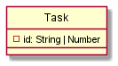

# Functioneel Ontwerp

# Domein klasse

## User Story #1 - Als gebruiker wil ik een taak aan mijn todo lijst toevoegen, zodat ik weet wat ik nog moet doen
Uit deze user story extraheer ik de klasse taak (task in het engels).
Todo-lijst is een kandidaat klasse, maar valt buiten de scope, omdat dit een controler klasse van de klasse Task is en daarmee voor nu dus geen domein klasse.
Uit de zodat leidt ik het boolean attribuut 'done' voor de task klasse af, die initieel false zal zijn.
Verder kan ik uit de zodat afleiden dat er ook een taak (task attribuut) is in de vorm van een string die beschrijft wat ik moet doen.

## User Story #2 - Als gebruiker wil ik een taak als afgerond kunnen markeren, zodat deze gecontroleerd kan worden.

Deze user story heeft weer betrekking op de klasse taak (Task) en vereist alleen het attribuut done.

## User Story #3 - Als gebruiker wil ik een afgeronde taak als niet afgerond kunnen marken, zodat duidelijk is dat deze taak toch nog niet klaar was.

Het domein model geeft ook alleen de klasse taak (Task) met een enkel attribuut (done)

## User Story #4 - Als gebruiker wil ik een taak kunnen verwijderen, zodat deze niet meer in mijn takenlijst verschijnt.

Om de te verwijderende taak (Task) te kunnen identificeren introduceren we hier nog een attribuut id, welk voor elke taak uniek zou moeten zijn.

## Conclusie

Uit bovenstaande analyse kunnen we concluderen dat het domein model er nu als volgt eruit komt te zien:

# Analyse van de klasse Task

## Toestandsdiagram
Toestandsdiag op basis van de user stories.

| Toestand | kenmerk |
| --- | --- |
| Todo | done == false |
| Done | done == true |
